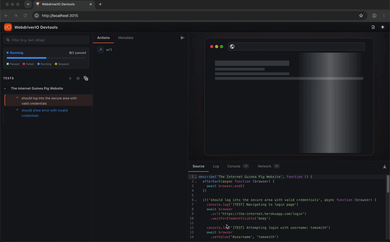
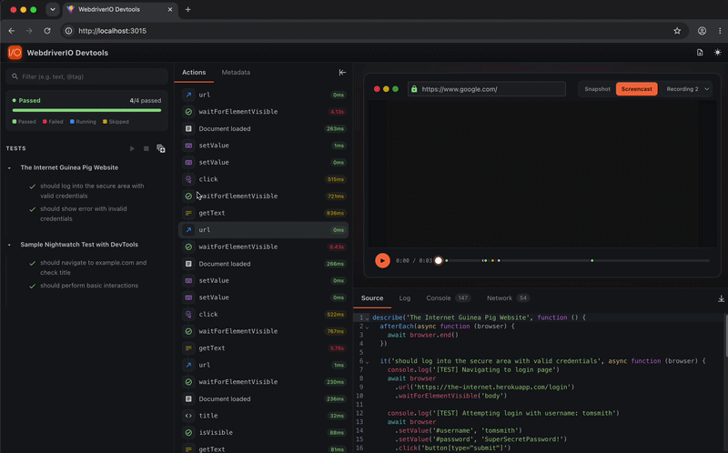
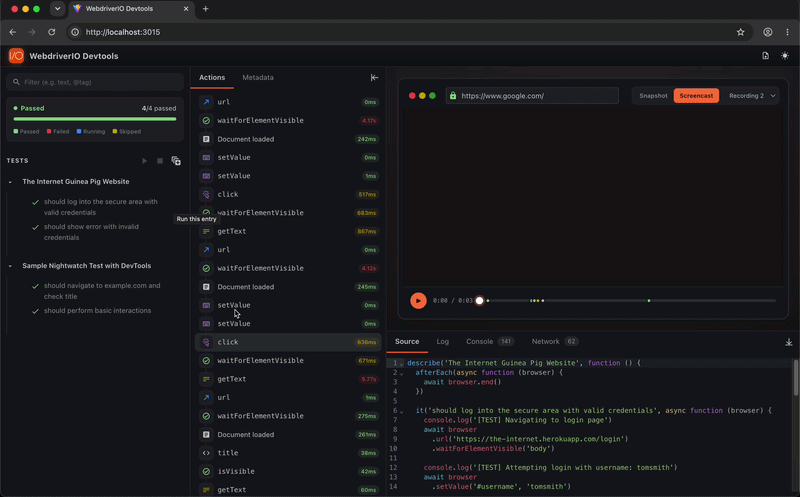
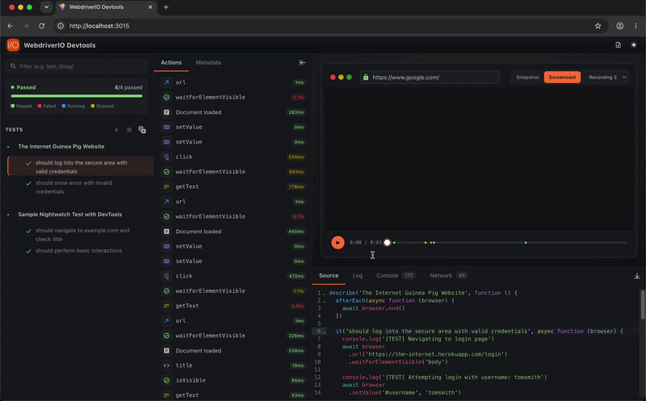
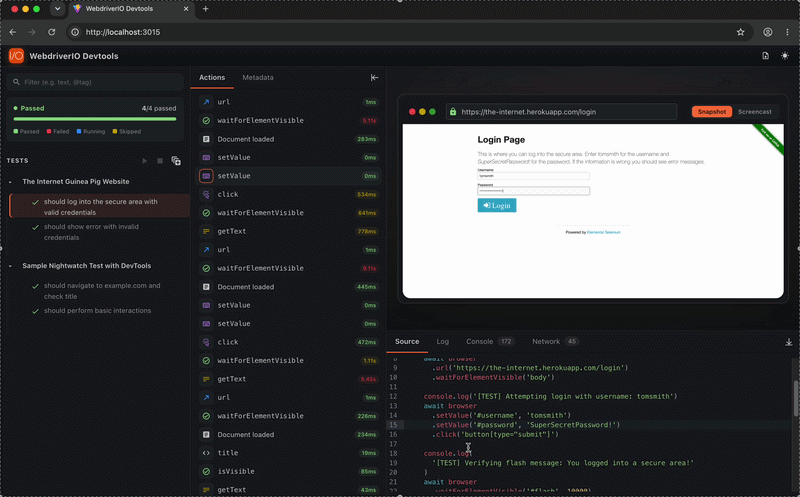
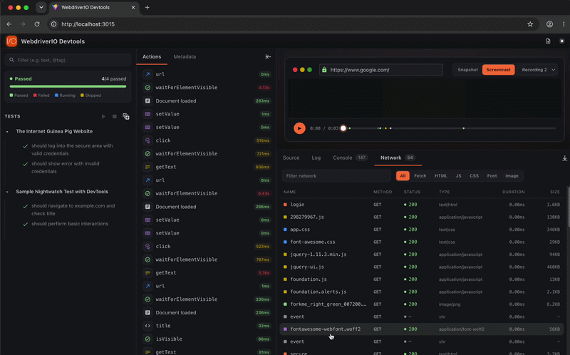
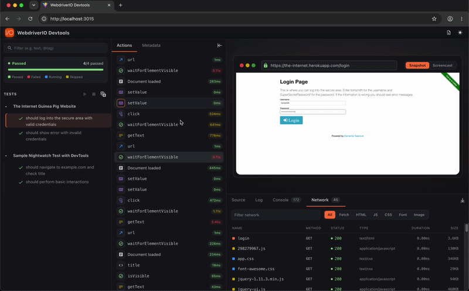
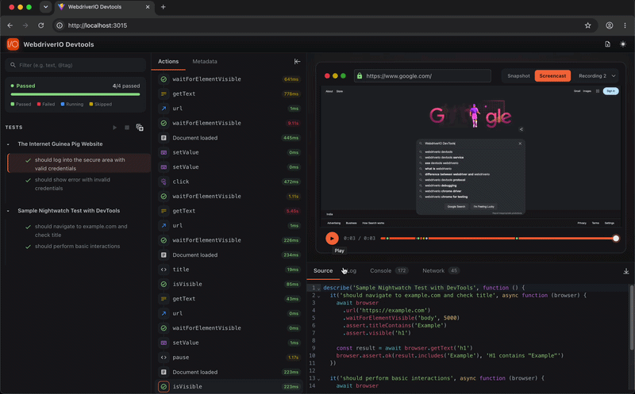
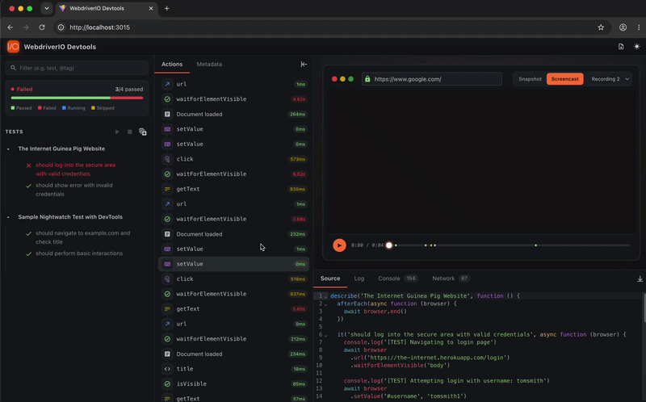
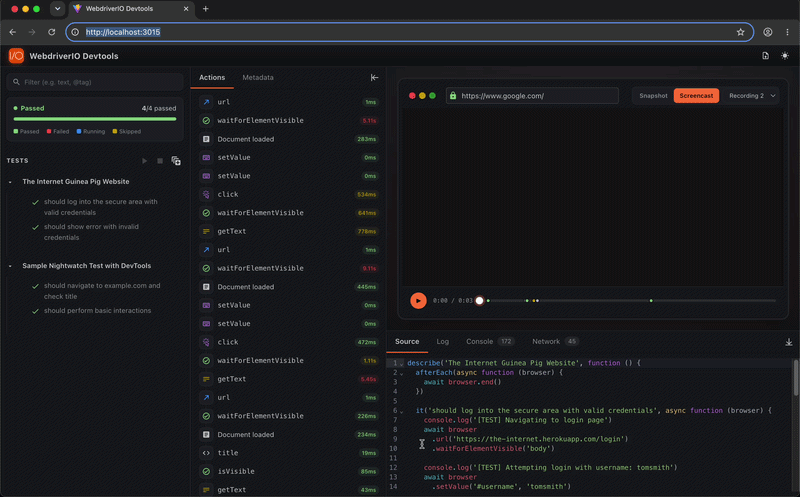

# WebdriverIO DevTools

A powerful browser devtools extension for debugging, visualizing, and controlling test executions in real-time.

Works with **WebdriverIO**, **[Nightwatch.js](./packages/nightwatch-devtools/README.md)**, and **[Selenium WebDriver](./packages/selenium-devtools/README.md)** (any test runner) — same backend, same UI, same capture infrastructure.

## Features

### 🎯 Interactive Test Execution
- **Selective Test Rerun**: Click play buttons on individual test cases, test suites, or Cucumber scenario examples to re-execute them instantly
- **Smart Browser Reuse**: Tests rerun in the same browser window without opening new tabs, improving performance and user experience
- **Stop Test Execution**: Terminate running tests with proper process cleanup using the stop button
- **Test List Preservation**: All tests remain visible in the sidebar during reruns, maintaining full context

### 🎭 Multi-Framework Support
- **Mocha**: Full support with grep-based filtering for test/suite execution
- **Jasmine**: Complete integration with grep-based filtering
- **Cucumber**: Scenario-level and example-specific execution with feature:line targeting

### 📊 Real-Time Visualization
- **Live Browser Preview**: View the application under test in a scaled iframe with automatic screenshot updates
- **Actions Timeline**: Command-by-command execution log with timestamps and parameters
- **Test Hierarchy**: Nested test suite and test case tree view with status indicators
- **Live Status Updates**: Immediate spinner icons and visual feedback when tests start/stop

### 🧐 Debugging Capabilities
- **Command Logging**: Detailed capture of all WebDriver commands with arguments and results
- **Screenshot Capture**: Automatic screenshots after each command for visual debugging
- **Source Code Mapping**: View the exact line of code that triggered each command
- **Console Logs**: Capture and display application console output with timestamps and log levels
- **Network Logs**: Monitor and inspect HTTP requests/responses including headers, payloads, timing, and status codes
- **Error Tracking**: Full error messages and stack traces for failed tests

### 🎮 Execution Controls
- **Global Test Running State**: All play buttons automatically disable during test execution to prevent conflicts
- **Immediate Feedback**: Spinner icons update instantly when tests start
- **Actions Tab Auto-Clear**: Execution data automatically clears and refreshes on reruns
- **Metadata Tracking**: Test duration, status, and execution timestamps

### 🎬 Session Screencast
- **Automatic Video Recording**: Captures a continuous `.webm` video of the browser session alongside the existing snapshot and DOM mutation views
- **Per-framework modes**:
  - **WebdriverIO**: CDP push mode for Chrome/Chromium (efficient, no per-command overhead); polling fallback for other browsers
  - **Selenium WebDriver**: CDP push mode via `selenium-webdriver/bidi`; polling fallback otherwise
  - **Nightwatch.js**: Polling mode (Nightwatch doesn't expose a stable CDP escape hatch); works on every browser Nightwatch supports
- **Per-Session Videos**: Each browser session (including sessions created by `browser.reloadSession()`) produces its own recording, selectable from a dropdown in the UI
- **Smart Trimming**: Leading blank frames before the first URL navigation are automatically removed so videos start at the first meaningful page action

> For setup, configuration options, and prerequisites see each adapter's README: **[WebdriverIO](./packages/service/README.md#screencast-recording)** · **[Selenium](./packages/selenium-devtools/README.md)** · **[Nightwatch](./packages/nightwatch-devtools/README.md#screencast)**.

### 🐞 Preserve & Rerun (Compare)
- **When the bug icon appears**: Only on test/suite rows in a `failed` state and the icon sits next to ▶ on hover, available wherever a plain rerun is supported (e.g. Cucumber scenarios at the scenario row, Mocha tests at the test or suite row)
- **Side-by-side diff**: Click the bug-play icon on a failed test to snapshot the failing run and rerun in one action and the Compare tab shows the two runs aligned by command, with the failure point and assertion error (Expected vs Received) called out
- **Diagnose flaky tests**: See exactly which command differed between a pass and a fail without re-reading logs
- **Pop out**: Open the comparison in a separate, themed window for a roomier view

> Available across **WebdriverIO, Selenium WebDriver, and Nightwatch.js**. The rerun mechanism differs per framework (WDIO uses `--spec` + grep, Selenium substitutes a runner-specific filter flag like `--grep`/`--testNamePattern`, Nightwatch reads `DEVTOOLS_RERUN_LABEL`); the dashboard contract is identical.

### 🌐 BiDi capture (browser console + JS exceptions + network)

Real-time capture of browser-side events through the WebDriver BiDi protocol — entries arrive in the dashboard as they happen instead of being scraped after each command.

| Adapter | BiDi source | Default | How to enable |
|---|---|---|---|
| **WebdriverIO** | WDIO's native `browser.on('log.entryAdded' \| 'network.*')` | On | Automatic when the driver advertises BiDi (Chrome ≥114) |
| **Selenium WebDriver** | `selenium-webdriver/bidi/{logInspector, networkInspector}` | On when available | Automatic; `ensureBidiCapability` sets `webSocketUrl=true` on the Builder |
| **Nightwatch.js** | Same `selenium-webdriver/bidi` inspectors (Nightwatch ships selenium-webdriver internally) | Opt-in | `globals: nightwatchDevtools({ bidi: true })` + `desiredCapabilities: { webSocketUrl: true }` |

When BiDi is active in Selenium or Nightwatch, the per-command Chrome performance-log network-capture path is gated off so requests don't appear twice in the dashboard. The attach + sink logic lives in `@wdio/devtools-core`'s `bidi.ts` — same module both adapters consume.

### 📦 Trace mode (trace.zip)

Headless capture path — no DevTools UI window opens. At session end the adapter writes a `trace-<sessionId>.zip` next to the user's spec / config file, suitable for offline replay, AI-agent diffing, or any consumer that prefers a portable artifact over a live UI.

| Adapter | How to enable |
|---|---|
| **WebdriverIO** | `services: [['devtools', { mode: 'trace' }]]` |
| **Selenium** | `DevTools.configure({ mode: 'trace' })` (before importing `selenium-webdriver`) |
| **Nightwatch** | `globals: nightwatchDevtools({ mode: 'trace' })` |

The zip contains:
- `trace.trace` — NDJSON `context-options` + `before`/`after` action events
- `trace.network` — HAR-style network entries derived from the existing capture
- `resources/page@<id>-<ts>.jpeg` — screenshot per user-facing action
- `resources/elements-page@<id>-<ts>.json` — flat interactable element list extracted by the page-injected scripts in `@wdio/devtools-core/element-scripts`
- `resources/snapshot-page@<id>-<ts>.txt` — depth-indented accessibility-tree snapshot (AI-friendly)
- `transcript.md` — human/LLM-readable Markdown transcript of the captured actions, with timing, selectors, and value annotations

What counts as a user-facing action is filtered through an allow-list in `@wdio/devtools-core/action-mapping.ts` (`url`, `click`, `setValue`, `sendKeys`, `get`, etc.). Internal commands like `findElement`/`waitUntil`/`executeScript` don't produce trace entries.

Trace mode and live mode are **mutually exclusive** — `screencast` options are ignored in trace mode (live-mode feature). Live and trace serve different audiences (humans debugging vs. agents diffing), and stacking them only costs perf.

#### Output layout — `traceFormat`

`{ mode: 'trace', traceFormat: 'zip' | 'ndjson-directory' }`. Default `'zip'` writes a single `trace-<sessionId>.zip`; `'ndjson-directory'` unpacks the same `trace.trace` + `trace.network` + `resources/` files into a `trace-<sessionId>/` folder. Both render in `npx playwright show-trace <path>`. The unpacked form skips the unzip step for scripted / agentic consumers.

#### 📱 Mobile testing

Adapters detect mobile sessions via `platformName: 'android' | 'ios'` (case-insensitive) and adjust the per-action snapshot to extract elements from the mobile XML tree instead of the DOM. The trace's `context-options` records `title: 'android' — <deviceName>` / `'ios' — <deviceName>` so the viewer labels frames correctly.

A reference WDIO config is at [examples/wdio/wdio.mobile.conf.ts](examples/wdio/wdio.mobile.conf.ts). Prereqs to run it end-to-end with a local emulator:

1. **Java JDK** — `brew install --cask temurin`
2. **Android SDK** — `brew install --cask android-commandlinetools` then `yes | sdkmanager --licenses && sdkmanager "platform-tools" "emulator" "system-images;android-34;google_apis_playstore;arm64-v8a"`. The brew cask installs sdkmanager under `/opt/homebrew/share/android-commandlinetools/`, and sdkmanager downloads other SDK pieces alongside it — set `ANDROID_HOME` to that path (not `~/Library/Android/sdk/`).
3. **AVD + emulator** — `avdmanager create avd -n devtools-test -k "system-images;android-34;google_apis_playstore;arm64-v8a" -d "pixel_7"`, then `emulator -avd devtools-test &` + `adb wait-for-device`.
4. **Appium + UiAutomator2 driver** — `sudo npm i -g appium && appium driver install uiautomator2`.
5. **Chromedriver pinning** — Appium's autodownload doesn't reach back far enough for the Chrome version that ships with most Android system images (e.g. Chrome 113 on Android 14). Manually download the matching Chromedriver and start Appium with `--default-capabilities '{"appium:chromedriverExecutableDir": "<path>"}'` plus `--allow-insecure=uiautomator2:chromedriver_autodownload`.
6. **Classic WebDriver protocol** — Appium 3's BiDi shim for UiAutomator2 doesn't implement every BiDi command (e.g. `script.addPreloadScript`). Set `'wdio:enforceWebDriverClassic': true` in the capability block so WDIO doesn't attempt the BiDi handshake.

These are emulator-specific issues; on a physical phone with USB debugging only steps 1, 4, 6 (and the Chromedriver pin if Chrome on the device is old) apply.

### 🔍︎ TestLens
- **Code Intelligence**: View test definitions directly in your editor
- **Run/Debug Actions**: Execute individual tests or suites with inline CodeLens actions
- **Quick Navigation**: Jump between test code and execution results seamlessly
- **Status Indicators**: Visual feedback for test pass/fail states in the editor

### 🏗️ Architecture
- **Frontend**: Lit web components with reactive state management (`@lit/context`)
- **Backend**: Fastify server with WebSocket streaming for real-time updates
- **Shared core**: All three adapters share the same capture/reporting library (`@wdio/devtools-core`) — `SessionCapturerBase`, `TestReporterBase`, `ScreencastRecorderBase`, plus pure helpers for console/network/error/sourcemap/BiDi
- **Process Management**: Tree-kill for proper cleanup of spawned processes

See [ARCHITECTURE.md](./ARCHITECTURE.md) for the full package map and data flow, and [CLAUDE.md](./CLAUDE.md) for the conventions in place across the repo.

## Demo

### ▶️ Test Runner


### 🛠️ Test Rerunner & Snapshot


### 🛑 Stop Test Runner


### ⚡ Actions & Command Logs


### >_ Console Logs


### 🌐 Network Logs


### 📋 Metadata


### 🎬 Session Screencast


### 🐞 Preserve & Rerun


### 🔍︎ TestLens


## Installation

**WebdriverIO:**
```bash
npm install @wdio/devtools-service
```

**Nightwatch:**
```bash
npm install @wdio/nightwatch-devtools
```

**Selenium:**
```bash
npm install @wdio/selenium-devtools
```

> See the [Nightwatch Integration](#nightwatch-integration) and [Selenium Integration](#selenium-integration) sections for configuration details.

## Configuration

Add the service to your `wdio.conf.js`:

```javascript
export const config = {
    // ...
    services: ['devtools']
}
```

## Usage

1. Run your WebdriverIO tests
2. The devtools UI automatically opens in an external browser window at `http://localhost:3000`
3. Tests begin executing immediately with real-time visualization
4. View live browser preview, test progress, and command execution
5. After initial run completes, use play buttons to rerun individual tests or suites
6. Click stop button anytime to terminate running tests
7. Explore actions, metadata, console logs, and source code in the workbench tabs

## Development

```bash
# Install dependencies
pnpm install

# Build all packages
pnpm build

# Run demo
pnpm demo:wdio
```

## Nightwatch Integration

Using [Nightwatch.js](https://nightwatchjs.org/)? A dedicated adapter package brings the same DevTools UI to your Nightwatch test suite with zero test code changes.

→ **[`@wdio/nightwatch-devtools`](./packages/nightwatch-devtools/README.md)** — configuration, Cucumber/BDD setup, and limitations.

## Selenium Integration

Using `selenium-webdriver` directly — under Mocha, Jest, Cucumber, or a plain Node script? A runner-agnostic adapter brings the same DevTools UI to any Selenium test suite. The plugin auto-detects the runner and wires test boundaries; no code changes required for hook-aware runners, and a small `DevTools.startTest/endTest` API for plain scripts.

→ **[`@wdio/selenium-devtools`](./packages/selenium-devtools/README.md)** — per-runner setup, configuration options, and screencast details.

## Project Structure

```
packages/
├── shared/                # Types, constants, HTTP/WS contracts — single source of truth
├── core/                  # Framework-agnostic capture/reporting library (SessionCapturerBase, etc.)
├── app/                   # Frontend Lit-based UI application
├── backend/               # Fastify server, WS gateway, baseline store, rerun spawner
├── script/                # Browser-injected trace collection script (runs in the page under test)
├── service/               # WebdriverIO adapter (@wdio/devtools-service)
├── nightwatch-devtools/   # Nightwatch adapter (@wdio/nightwatch-devtools)
└── selenium-devtools/     # Selenium WebDriver adapter (@wdio/selenium-devtools)
```

`shared` and `core` are workspace-internal (`"private": true`) — every consumer bundles them into its own `dist/` at build time. The three adapter packages each translate framework-specific hooks into calls on `core`'s shared capture library; `backend` and `app` import only from `shared` and communicate via the WS/HTTP boundary.

## Contributing

Contributions are welcome! Please feel free to submit a Pull Request.

## :page_facing_up: License

[MIT](/LICENSE)
