# WebdriverIO DevTools

A powerful browser devtools extension for debugging, visualizing, and controlling test executions in real-time.

Works with **WebdriverIO**, **[Nightwatch.js](./packages/nightwatch-devtools/README.md)**, **[Selenium WebDriver](./packages/selenium-devtools/README.md)** (any test runner), and **[Python Selenium](./packages/selenium-devtools-py/README.md)** — same backend, same UI, same capture infrastructure.

It runs in two modes: **live** — an interactive dashboard that opens as your tests run — and **trace** — a portable `trace.zip` artifact for offline replay, CI, and AI-agent diffing.

## Quick Start

Install the adapter for your framework, add it to your config, and run — the DevTools dashboard opens automatically.

```bash
npm install @wdio/devtools-service --save-dev   # WebdriverIO (Nightwatch / Selenium below)
```

```js
// wdio.conf.js
export const config = {
  services: ['devtools'] // live mode — opens the dashboard on run
}
```

```bash
npx wdio run wdio.conf.js
```

Want a portable artifact instead of a live UI (CI / agent diffing)? Switch to **trace mode** — see [Configuration](#configuration) and [Usage](#usage). Full setup for each framework: [Installation](#installation) · [Nightwatch](#nightwatch-integration) · [Selenium](#selenium-integration).

## Features

### 🎯 Interactive Test Execution
- **Selective Test Rerun**: Click play buttons on individual test cases, test suites, or Cucumber scenario examples to re-execute them instantly
- **Smart Browser Reuse**: Tests rerun in the same browser window without opening new tabs, improving performance and user experience
- **Stop Test Execution**: Terminate running tests with proper process cleanup using the stop button
- **Test List Preservation**: All tests remain visible in the sidebar during reruns, maintaining full context

### 🎭 Multi-Framework Support
- **Mocha**: Full support with grep-based filtering for test/suite execution
- **Jasmine**: Complete integration with grep-based filtering
- **Cucumber**: Scenario-level and example-specific execution with feature:line targeting

### 📊 Real-Time Visualization
- **Live Browser Preview**: View the application under test in a scaled iframe with automatic screenshot updates
- **Actions Timeline**: Command-by-command execution log with timestamps and parameters
- **Test Hierarchy**: Nested test suite and test case tree view with status indicators
- **Live Status Updates**: Immediate spinner icons and visual feedback when tests start/stop

### 🧐 Debugging Capabilities
- **Command Logging**: Detailed capture of all WebDriver commands with arguments and results
- **Screenshot Capture**: Automatic screenshots after each command for visual debugging
- **Source Code Mapping**: View the exact line of code that triggered each command
- **Console Logs**: Capture and display application console output with timestamps and log levels
- **Network Logs**: Monitor and inspect HTTP requests/responses including headers, payloads, timing, and status codes
- **Error Tracking**: Full error messages and stack traces for failed tests

### 🎮 Execution Controls
- **Global Test Running State**: All play buttons automatically disable during test execution to prevent conflicts
- **Immediate Feedback**: Spinner icons update instantly when tests start
- **Actions Tab Auto-Clear**: Execution data automatically clears and refreshes on reruns
- **Metadata Tracking**: Test duration, status, and execution timestamps

### 🎬 Session Screencast
- **Automatic Video Recording**: Captures a continuous `.webm` video of the browser session alongside the existing snapshot and DOM mutation views
- **Per-framework modes**:
  - **WebdriverIO**: CDP push mode for Chrome/Chromium (efficient, no per-command overhead); polling fallback for other browsers
  - **Selenium WebDriver**: CDP push mode via `selenium-webdriver/bidi`; polling fallback otherwise
  - **Nightwatch.js**: Polling mode (Nightwatch doesn't expose a stable CDP escape hatch); works on every browser Nightwatch supports
- **Per-Session Videos**: Each browser session (including sessions created by `browser.reloadSession()`) produces its own recording, selectable from a dropdown in the UI
- **Smart Trimming**: Leading blank frames before the first URL navigation are automatically removed so videos start at the first meaningful page action

> For setup, configuration options, and prerequisites see each adapter's README: **[WebdriverIO](./packages/service/README.md#screencast-recording)** · **[Selenium](./packages/selenium-devtools/README.md)** · **[Nightwatch](./packages/nightwatch-devtools/README.md#screencast)**.

### 🐞 Preserve & Rerun (Compare)
- **When the bug icon appears**: Only on test/suite rows in a `failed` state and the icon sits next to ▶ on hover, available wherever a plain rerun is supported (e.g. Cucumber scenarios at the scenario row, Mocha tests at the test or suite row)
- **Side-by-side diff**: Click the bug-play icon on a failed test to snapshot the failing run and rerun in one action and the Compare tab shows the two runs aligned by command, with the failure point and assertion error (Expected vs Received) called out
- **Diagnose flaky tests**: See exactly which command differed between a pass and a fail without re-reading logs
- **Pop out**: Open the comparison in a separate, themed window for a roomier view

> Available across **WebdriverIO, Selenium WebDriver, and Nightwatch.js**. The rerun mechanism differs per framework (WDIO uses `--spec` + grep, Selenium substitutes a runner-specific filter flag like `--grep`/`--testNamePattern`, Nightwatch reads `DEVTOOLS_RERUN_LABEL`); the dashboard contract is identical.

### 🌐 BiDi capture (browser console + JS exceptions + network)

Real-time capture of browser-side events through the WebDriver BiDi protocol — entries arrive in the dashboard as they happen instead of being scraped after each command.

| Adapter | BiDi source | Default | How to enable |
|---|---|---|---|
| **WebdriverIO** | WDIO's native `browser.on('log.entryAdded' \| 'network.*')` | On | Automatic when the driver advertises BiDi (Chrome ≥114) |
| **Selenium WebDriver** | `selenium-webdriver/bidi/{logInspector, networkInspector}` | On when available | Automatic; `ensureBidiCapability` sets `webSocketUrl=true` on the Builder |
| **Nightwatch.js** | Same `selenium-webdriver/bidi` inspectors (Nightwatch ships selenium-webdriver internally) | Opt-in | `globals: nightwatchDevtools({ bidi: true })` + `desiredCapabilities: { webSocketUrl: true }` |

When BiDi is active in Selenium or Nightwatch, the per-command Chrome performance-log network-capture path is gated off so requests don't appear twice in the dashboard. The attach + sink logic lives in `@wdio/devtools-core`'s `bidi.ts` — same module both adapters consume.

### 📦 Trace mode (trace.zip)

The dashboard runs in one of **two modes**, set per adapter via the shared `mode` option:

- **`live`** (default) — the interactive DevTools UI window described above.
- **`trace`** — a headless capture path that writes a portable trace archive, opened later in the **trace player**.

All three JavaScript adapters (`@wdio/devtools-service`, `@wdio/selenium-devtools`, `@wdio/nightwatch-devtools`) emit the **same normalized trace** through the shared `@wdio/devtools-core` capture library, so one archive format and one player serve every framework.

The trace **format and the player are identical** across those three, but **capture completeness varies** — WebdriverIO is the most complete; Selenium and Nightwatch cover the core flow with some gaps (e.g. inline-Allure per-test artifacts, retry-aware retention, Cucumber step nesting, auto BiDi). Each adapter's README lists its specifics.

**Trace-mode support by adapter:**

| Capability | WebdriverIO | Selenium | Nightwatch |
|---|---|---|---|
| Trace mode + `show-trace` player | ✅ | ✅ | ✅ |
| DOM time-travel (mutation capture) | ✅ | ✅ ¹ | ✅ |
| Dense filmstrip (`filmstrip`) | ✅ CDP push | ✅ CDP push | ⚠️ polling only |
| Per-test granularity (`traceGranularity: 'test'`) | ✅ | ✅ | ⚠️ ² |
| Retry-aware retention (`tracePolicy`) | ✅ | ✅ | ⚠️ ³ |
| Cucumber step nesting | Scenario→Step ⁴ | ✅ full | Feature→Scenario ⁵ |
| Inline Allure attach | ✅ | ✅ | ⚠️ produce-only ⁶ |
| Assertion capture (`captureAssertions`) | ✅ | ✅ | ✅ |
| Auto BiDi capture | ✅ auto | ✅ auto | ⚠️ opt-in ⁷ |

¹ Selenium reconstructs the DOM per navigation; anchor timing is approximate (a navigation's snapshot can lag the command that triggered it).
² Nightwatch's Cucumber and exports-object interfaces get real per-test slicing; the BDD `describe/it` interface collapses to a single session-scoped slice keyed to the first test.
³ Only `retain-on-failure` works; the other retry-aware policies degrade to it because Nightwatch's `--retries` re-runs a testcase internally without re-firing the per-test hooks.
⁴ WebdriverIO does not yet carry feature-level ancestry, so its Cucumber nesting is Scenario→Step.
⁵ Nightwatch does not yet stamp per-step nesting (Feature→Scenario only).
⁶ Nightwatch has no live Allure attach API, so per-test `screenshot`/`video` are written to disk and listed in the manifest but not attached to an Allure test.
⁷ Opt-in via `bidi: true` + `webSocketUrl: true` in capabilities.

In trace mode no DevTools UI window opens. At session end the adapter writes trace artifacts into a `test-results/` folder (created next to the resolved spec/config directory), suitable for offline replay, AI-agent diffing, or any consumer that prefers a portable artifact over a live UI.

| Adapter | How to enable |
|---|---|
| **WebdriverIO** | `services: [['devtools', { mode: 'trace' }]]` |
| **Selenium** | `DevTools.configure({ mode: 'trace' })` (before importing `selenium-webdriver`) |
| **Nightwatch** | `globals: nightwatchDevtools({ mode: 'trace' })` |

The trace artifact contains:
- `trace.trace` — NDJSON `context-options` + `before`/`after` action events. When test hooks are available (Mocha's `it()` / Cucumber's `Scenario()`), each test becomes a `Tracing.tracingGroup` span — an open/close `before`/`after` pair with `method: "tracingGroup"` and `params.name` set to the test title. Child actions inside the group carry `parentId` pointing back to the group's `callId`, so timeline viewers render tests as labelled spans wrapping their commands.
- `trace.network` — HAR-style network entries derived from the existing capture
- `resources/page@<id>-<ts>.jpeg` — screenshot per user-facing action
- `resources/page@<id>-<ts>-elements.json` — flat interactable element list extracted by the page-injected scripts in `@wdio/devtools-core/element-scripts`
- `resources/page@<id>-<ts>-snapshot.txt` — depth-indented accessibility-tree snapshot (AI-friendly)
- `transcript.md` — human/LLM-readable Markdown transcript of the captured actions, with timing, selectors, and value annotations

What counts as a user-facing action is filtered through an allow-list in `@wdio/devtools-core/action-mapping.ts` (`url`, `click`, `setValue`, `sendKeys`, `get`, etc.). Internal commands like `findElement`/`waitUntil`/`executeScript` don't produce trace entries.

Trace mode and live mode are **mutually exclusive** — `screencast` options are ignored in trace mode (live-mode feature). Live and trace serve different audiences (humans debugging vs. agents diffing), and stacking them only costs perf.

#### Viewing traces

**First-party player — `show-trace`.** Open a `.zip` in the WebdriverIO DevTools UI itself:

```sh
pnpm show-trace path/to/trace.zip     # from this repo
npx show-trace path/to/trace.zip      # in a project that installs an adapter
```

`show-trace` reconstructs the trace and serves the same DevTools UI in a dedicated **player** mode: the action list on the left, the page snapshot in the browser pane, and a bottom timeline with a filmstrip, action/network tracks, a draggable playhead, and playback controls (play/step/speed). Click a **Network** bar to open its request detail; press **`?`** for keyboard shortcuts (`Space` play/pause, `←`/`→` step, `Home`/`End`, `,`/`.` speed).

The player exposes everything captured in the archive:

- **DOM time-travel** — the browser pane replays the page from the captured DOM **mutation stream**, so scrubbing the playhead reconstructs the live DOM at any point, not just a screenshot.
- **A11y tab** — the accessibility tree (roles + accessible names) captured for the selected command; hover a row to outline the element in the snapshot, click to copy its locator. Locators are generated in the recording runner's own dialect. An element identified only by its text is `a*=Logout` under WebdriverIO and `//a[contains(., "Logout")]` under Selenium, where the panel names the strategy that resolves it (`By.xpath()`). **Nightwatch prefers a native CSS locator** (`button[type="submit"]`, `a.button`) — it is the only runner that reads a bare selector string under a default CSS strategy — and falls back to XPath, captioned `useXpath()` / `locateStrategy: 'xpath'`, only when nothing unique exists. Every other branch is portable CSS.
- **Errors tab** — every failing `expect`/assertion and step failure collected in one place, each with a jump-to-source link to the command that threw.
- **Element overlay (pick-locator)** — labelled, click-to-copy boxes drawn over every element the test interacted with, cross-linked to the A11y rows.
- **Transcript tab + Copy-for-LLM** — the run's Markdown transcript with a one-click "copy prompt" that bundles it with any failing-command errors, paste-ready for an LLM.
- **Cucumber Feature → Scenario → Step nesting** — tests render as labelled `tracingGroup` spans wrapping their commands, with Cucumber steps nested under their scenario.
- **Dense filmstrip** — with `filmstrip` enabled, the timeline scrubs a continuous screencast for smooth playback rather than one frame per action.
- **Timeline input markers** — keyboard actions and pointer hits (commands with a captured hit point) get distinct glyphs on the timeline.

The `show-trace` bin is exposed by each JavaScript adapter (`@wdio/devtools-service`, `@wdio/nightwatch-devtools`, `@wdio/selenium-devtools`), so `pnpm show-trace <zip>` / `npx show-trace <zip>` work in any project that installs one — no extra dependency.

**Other viewers.** The trace uses a portable NDJSON schema, so the same `.zip` also opens in other compatible standalone trace viewers that read the format, and — because it shares that on-disk format — is what an Allure report's **embedded trace viewer** (Allure ≥ 2.35) reads. See the [backend README](./packages/backend/README.md#trace-serving--show-trace) for the reader details.

#### Options

| Option | Values | Default | Description |
|--------|--------|---------|-------------|
| `mode` | `'live'` \| `'trace'` | `'live'` | `'live'` launches the DevTools UI; `'trace'` writes an offline artifact. |
| `traceFormat` | `'zip'` \| `'ndjson-directory'` | `'zip'` | Output layout. `'zip'` writes a single archive; `'ndjson-directory'` unpacks into `trace-<id>/`. |
| `traceGranularity` | `'session'` \| `'spec'` \| `'test'` | `'session'` | `'session'` writes one trace per worker; `'spec'` one per spec file; `'test'` one per test into its own `<spec>-<title>-<browser>[-retryN]/trace.zip` folder — the smallest, most navigable artifacts, and the best pairing for a retention policy. |
| `tracePolicy` | `'on'` \| `'retain-on-failure'` \| `'retain-on-first-failure'` \| `'on-first-retry'` \| `'on-all-retries'` \| `'retain-on-failure-and-retries'` | `'on'` | Which traces to keep. `'on'` keeps every trace; the rest keep only failing/retried tests — pairs well with `traceGranularity: 'test'`. |
| `captureAssertions` | `boolean` | `true` | Capture assertions as action rows: `node:assert` (all adapters), WebdriverIO `expect(...)` matchers, and Nightwatch `browser.assert`/`verify`. Set `false` to opt out. |
| `filmstrip` | `boolean` | `true` | Record a dense, continuous screencast *into* the trace for smooth scrubbing in the player (not just one frame per action). Dense frames sit alongside the per-action frames; thinned + content-addressed at export. Runs the screencast recorder (CDP push on Chrome, polling elsewhere). |
| `emitArtifactsManifest` | `boolean` | auto | Write `devtools-artifacts-<sessionId>.json` next to the trace — the index reporters/CI read to discover produced artifacts. Off by default; auto-enabled when an Allure reporter is detected (Nightwatch stays opt-in). |

The per-test **`screenshot`** and **`video`** artifact options live on the WebdriverIO and Selenium adapters (not the shared base), are gated to `traceGranularity: 'test'`, and attach inline to Allure — see the [WebdriverIO](./packages/service/README.md#allure-integration) and [Selenium](./packages/selenium-devtools/README.md) READMEs for the full per-adapter option tables.

**Allure integration.** When an Allure reporter is present, per-test traces, screenshots, and videos attach to each test's card (`traceGranularity: 'test'`); coarser granularities write the artifacts to disk and list them in the manifest. Details and the report-noise settings are in the [WebdriverIO adapter README](./packages/service/README.md#allure-integration).

WDIO config example:

```js
services: [[DevToolsHookService, {
    mode: 'trace',
    traceFormat: 'zip',
    traceGranularity: 'spec'     // one trace per spec file
}]]
```

> **Requires BiDi.** Trace mode uses a WebDriver BiDi preload script. Both Chrome (≥114) and Firefox (≥130) enable BiDi automatically — no capability flags needed.

#### 📱 Mobile testing

Adapters detect mobile sessions via `platformName: 'android' | 'ios'` (case-insensitive) and adjust the per-action snapshot to extract elements from the mobile XML tree instead of the DOM. The trace's `context-options` records `title: 'android' — <deviceName>` / `'ios' — <deviceName>` so the viewer labels frames correctly.

A reference WDIO config is at [examples/wdio/cucumber/wdio.mobile.conf.ts](examples/wdio/cucumber/wdio.mobile.conf.ts). Prereqs to run it end-to-end with a local emulator:

1. **Java JDK** — `brew install --cask temurin`
2. **Android SDK** — `brew install --cask android-commandlinetools` then `yes | sdkmanager --licenses && sdkmanager "platform-tools" "emulator" "system-images;android-34;google_apis_playstore;arm64-v8a"`. The brew cask installs sdkmanager under `/opt/homebrew/share/android-commandlinetools/`, and sdkmanager downloads other SDK pieces alongside it — set `ANDROID_HOME` to that path (not `~/Library/Android/sdk/`).
3. **AVD + emulator** — `avdmanager create avd -n devtools-test -k "system-images;android-34;google_apis_playstore;arm64-v8a" -d "pixel_7"`, then `emulator -avd devtools-test &` + `adb wait-for-device`.
4. **Appium + UiAutomator2 driver** — `sudo npm i -g appium && appium driver install uiautomator2`.
5. **Chromedriver pinning** — Appium's autodownload doesn't reach back far enough for the Chrome version that ships with most Android system images (e.g. Chrome 113 on Android 14). Manually download the matching Chromedriver and start Appium with `--default-capabilities '{"appium:chromedriverExecutableDir": "<path>"}'` plus `--allow-insecure=uiautomator2:chromedriver_autodownload`.
6. **Classic WebDriver protocol** — Appium 3's BiDi shim for UiAutomator2 doesn't implement every BiDi command (e.g. `script.addPreloadScript`). Set `'wdio:enforceWebDriverClassic': true` in the capability block so WDIO doesn't attempt the BiDi handshake.

These are emulator-specific issues; on a physical phone with USB debugging only steps 1, 4, 6 (and the Chromedriver pin if Chrome on the device is old) apply.

### 🔍︎ TestLens
- **Code Intelligence**: View test definitions directly in your editor
- **Run/Debug Actions**: Execute individual tests or suites with inline CodeLens actions
- **Quick Navigation**: Jump between test code and execution results seamlessly
- **Status Indicators**: Visual feedback for test pass/fail states in the editor

### 🏗️ Architecture
- **Frontend**: Lit web components with reactive state management (`@lit/context`)
- **Backend**: Fastify server with WebSocket streaming for real-time updates
- **Shared core**: The three JavaScript adapters share the same capture/reporting library (`@wdio/devtools-core`) — `SessionCapturerBase`, `TestReporterBase`, `ScreencastRecorderBase`, plus pure helpers for console/network/error/sourcemap/BiDi
- **Process Management**: Tree-kill for proper cleanup of spawned processes

See [ARCHITECTURE.md](./ARCHITECTURE.md) for the full package map and data flow, and [CLAUDE.md](./CLAUDE.md) for the conventions in place across the repo.

## Demo

### ▶️ Test Runner
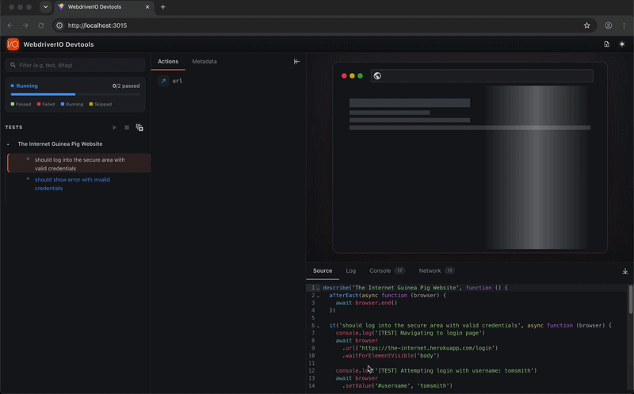

### 🛠️ Test Rerunner & Snapshot
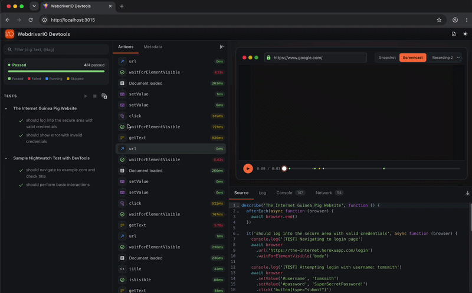

### 🛑 Stop Test Runner
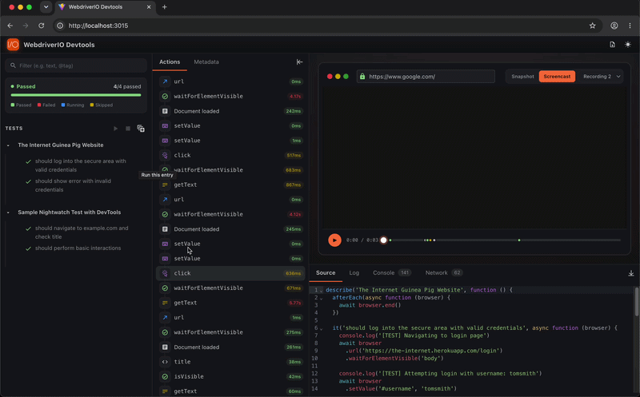

### ⚡ Actions & Command Logs
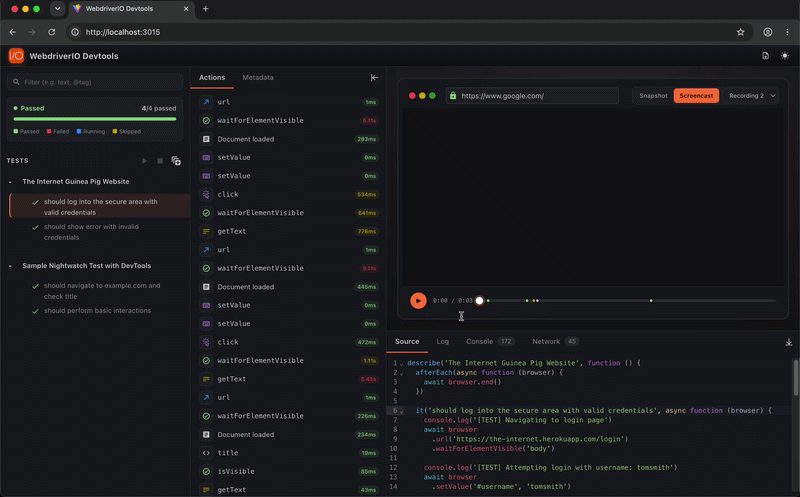

### >_ Console Logs
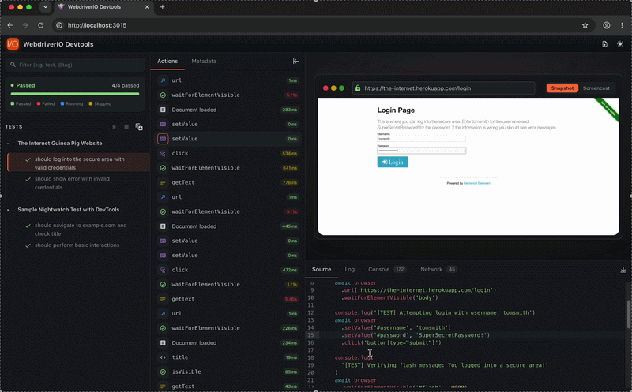

### 🌐 Network Logs
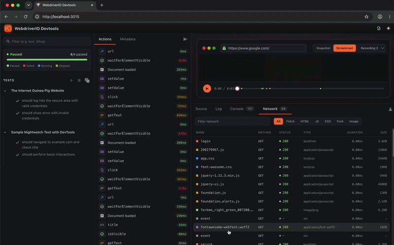

### 📋 Metadata
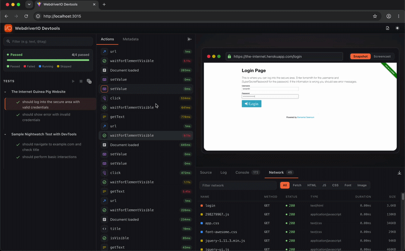

### 🎬 Session Screencast
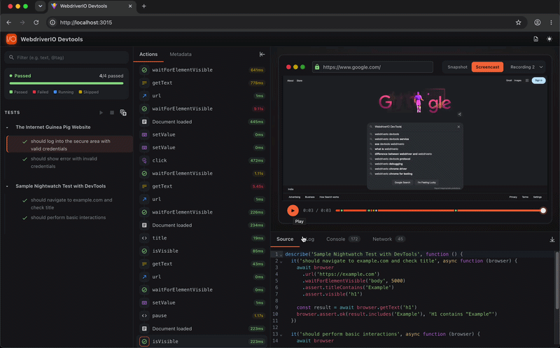

### 🐞 Preserve & Rerun
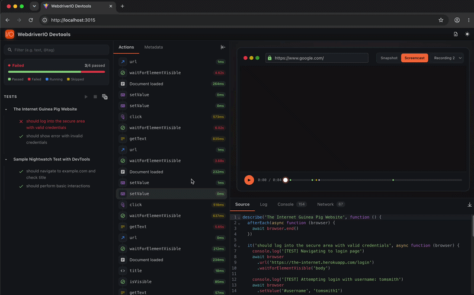

### 🔍︎ TestLens
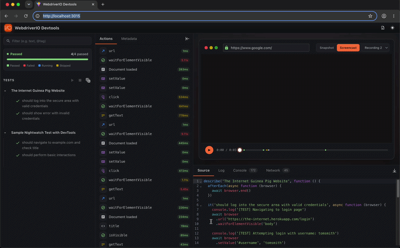

## Installation

**WebdriverIO:**
```bash
npm install @wdio/devtools-service
```

**Nightwatch:**
```bash
npm install @wdio/nightwatch-devtools
```

**Selenium:**
```bash
npm install @wdio/selenium-devtools
```

**Python (Selenium):**
```bash
pip install -e packages/selenium-devtools-py   # or: pip install selenium-devtools-py (when published)
```

The Python adapter needs Python 3.10+, selenium 4.44+, and **Node.js 18+ on your
PATH** — the backend that serves the page collector, carries the event stream
and builds the trace archive is a Node app, so Node is required in every mode,
not just for the dashboard window.

> See the [Nightwatch Integration](#nightwatch-integration), [Selenium Integration](#selenium-integration) and [Python Integration](#python-integration) sections for configuration details.

## Configuration

**Live mode** (default) — opens the dashboard:

```javascript
// wdio.conf.js
export const config = {
  services: ['devtools']
}
```

**Trace mode** — writes a portable `trace.zip` under `test-results/`, no UI window:

```javascript
export const config = {
  services: [['devtools', { mode: 'trace' }]]
}
```

Common options (all optional):

| Option | Values | Default | Notes |
|---|---|---|---|
| `mode` | `'live'` \| `'trace'` | `'live'` | Dashboard vs. portable artifact |
| `traceFormat` | `'zip'` \| `'ndjson-directory'` | `'zip'` | Trace mode only |
| `traceGranularity` | `'session'` \| `'spec'` \| `'test'` | `'session'` | One trace per session / spec / test |
| `tracePolicy` | `'on'` \| `'retain-on-failure'` \| … | `'on'` | Which traces to keep (trace mode) |
| `filmstrip` | `boolean` | `true` | Dense screencast into the trace |
| `screenshot` | `'off'` \| `'on'` \| `'only-on-failure'` | `'off'` | Per-test; needs `traceGranularity: 'test'` |
| `video` | `'off'` \| `<tracePolicy>` | `'off'` | Per-test; needs `traceGranularity: 'test'` |
| `captureAssertions` | `boolean` | `true` | Capture assertions as action rows |

**Full option reference:** [`@wdio/devtools-service` README](./packages/service/README.md#reference) — plus the [Nightwatch](./packages/nightwatch-devtools/README.md#reference) and [Selenium](./packages/selenium-devtools/README.md#reference) references.

## Usage

### Live mode

1. Run your WebdriverIO tests
2. The devtools UI automatically opens in an external browser window
3. Tests begin executing immediately with real-time visualization
4. View live browser preview, test progress, and command execution
5. After the initial run, use the play buttons to rerun individual tests or suites
6. Click stop anytime to terminate running tests
7. Explore actions, metadata, console logs, and source in the workbench tabs

### Trace mode

With `mode: 'trace'` no UI opens — the run writes a portable `trace.zip` under `test-results/`. Open it in the first-party player (the `show-trace` bin ships with each adapter):

```bash
pnpm show-trace test-results/trace-<sessionId>.zip
# or from a project that installs an adapter:
npx show-trace <path-to-trace.zip>
```

<p align="center">
  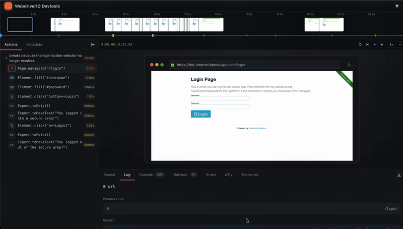
</p>

See the [Trace mode](./packages/service/README.md#trace-mode) section for the full artifact contents and player features.

## Development

```bash
pnpm install          # install workspace dependencies
pnpm build            # build all packages
pnpm test             # run the vitest suite
pnpm test:coverage    # run with coverage (thresholds enforced in CI)
pnpm lint             # lint all packages

# Run an example project for manual UI / runtime verification:
pnpm demo:wdio        # or: pnpm demo:nightwatch / pnpm demo:selenium
```

See **[CONTRIBUTING.md](./CONTRIBUTING.md)** for the full contributor workflow and **[ARCHITECTURE.md](./ARCHITECTURE.md)** for where each piece lives.

## Nightwatch Integration

Using [Nightwatch.js](https://nightwatchjs.org/)? A dedicated adapter package brings the same DevTools UI to your Nightwatch test suite with zero test code changes.

→ **[`@wdio/nightwatch-devtools`](./packages/nightwatch-devtools/README.md)** — configuration, Cucumber/BDD setup, and limitations.

## Selenium Integration

Using `selenium-webdriver` directly — under Mocha, Jest, Cucumber, or a plain Node script? A runner-agnostic adapter brings the same DevTools UI to any Selenium test suite. The plugin auto-detects the runner and wires test boundaries; no code changes required for hook-aware runners, and a small `DevTools.startTest/endTest` API for plain scripts.

→ **[`@wdio/selenium-devtools`](./packages/selenium-devtools/README.md)** — per-runner setup, configuration options, and screencast details.

## Python Integration

Writing your Selenium tests in Python? A fourth adapter feeds the same backend and UI over the same language-neutral `{scope, data}` contract. Under pytest nothing goes in your test files — the plugin ships with the package and pytest auto-discovers it, so opting in is a flag rather than an import.

**Both modes work.** Live mode streams to the dashboard; trace mode writes the same portable `trace.zip` the JavaScript adapters do, under `test-results/` beside the test file, and opens in the same player:

```bash
pytest --devtools tests/              # live dashboard
pytest --devtools-trace tests/        # trace archive instead, no dashboard window
pnpm show-trace test-results/trace-<sessionId>.zip
```

The player is the `show-trace` bin of the Node backend the adapter already needs, so there is nothing extra to install.

Capture is always opt-in, and there are three ways to say yes — `--devtools` / `--devtools-trace` for one run, `devtools` / `devtools_trace` under `[tool.pytest.ini_options]` for a project, `DEVTOOLS_ENABLE=1` (or `DEVTOOLS_PORT=<n>`, which also attaches to a running backend) for a shell. Highest wins, in that order. A plain script calls `devtools.enable(trace=True)` instead.

A Python trace carries the dense filmstrip, the A11y tree with its element overlay, DOM time-travel, console, network, per-command screenshots and command selectors. The transforms that build the zip stay in the backend rather than being ported ([#298](https://github.com/webdriverio/devtools/issues/298)), so trace mode starts the backend but opens no window.

Two settings shape the output, as flags, ini options, environment variables or `enable()` arguments: `traceGranularity` (`session`, the default, or `test` for one archive per test) and `tracePolicy` (`on`, or `retain-on-failure` to keep only what failed). Together, `test` + `retain-on-failure` writes one archive per failing test and nothing for a green run. The four retry-aware policies are accepted but behave exactly like `retain-on-failure` — nothing on the wire carries an attempt number. Per-test `screenshot`, `video` and inline Allure attach remain Node.js-only; it is the trace archive that is per-test.

→ **[`selenium-devtools-py`](./packages/selenium-devtools-py/README.md)** — pytest and plain-script setup, trace mode, assertions, run controls, Preserve & Rerun, and parallel runs.

## Project Structure

```
packages/
├── shared/                # Types, constants, HTTP/WS contracts — single source of truth
├── core/                  # Framework-agnostic capture/reporting library (SessionCapturerBase, etc.)
├── app/                   # Frontend Lit-based UI application
├── backend/               # Fastify server, WS gateway, baseline store, rerun spawner
├── script/                # Browser-injected trace collection script (runs in the page under test)
├── elements/              # Element-detection scripts — getSnapshot, a11y tree, element list (@wdio/elements)
├── service/               # WebdriverIO adapter (@wdio/devtools-service)
├── nightwatch-devtools/   # Nightwatch adapter (@wdio/nightwatch-devtools)
├── selenium-devtools/     # Selenium WebDriver adapter (@wdio/selenium-devtools)
└── selenium-devtools-py/  # Python Selenium adapter (selenium-devtools-py) — live + trace
```

`shared` and `core` are workspace-internal (`"private": true`) — every consumer bundles them into its own `dist/` at build time. The three JavaScript adapter packages each translate framework-specific hooks into calls on `core`'s shared capture library; the Python adapter speaks the same wire contract without sharing that code, which is what [#278](https://github.com/webdriverio/devtools/issues/278) exists to address; `backend` and `app` import only from `shared` and communicate via the WS/HTTP boundary.

## Contributing

Contributions are welcome! Start here:

- **[CONTRIBUTING.md](./CONTRIBUTING.md)** — dev setup, running tests & lint, changesets, and the pre-push / PR checklist.
- **[ARCHITECTURE.md](./ARCHITECTURE.md)** — the package map and the "where does my change go?" decision tree.
- **[CLAUDE.md](./CLAUDE.md)** — the repo conventions (single source of truth, thin adapters, testing floor, commit style).

Rule of thumb: **one concern per PR**, and any change that would otherwise land in two or more adapters belongs in `core`.

## :page_facing_up: License

[MIT](/LICENSE)
